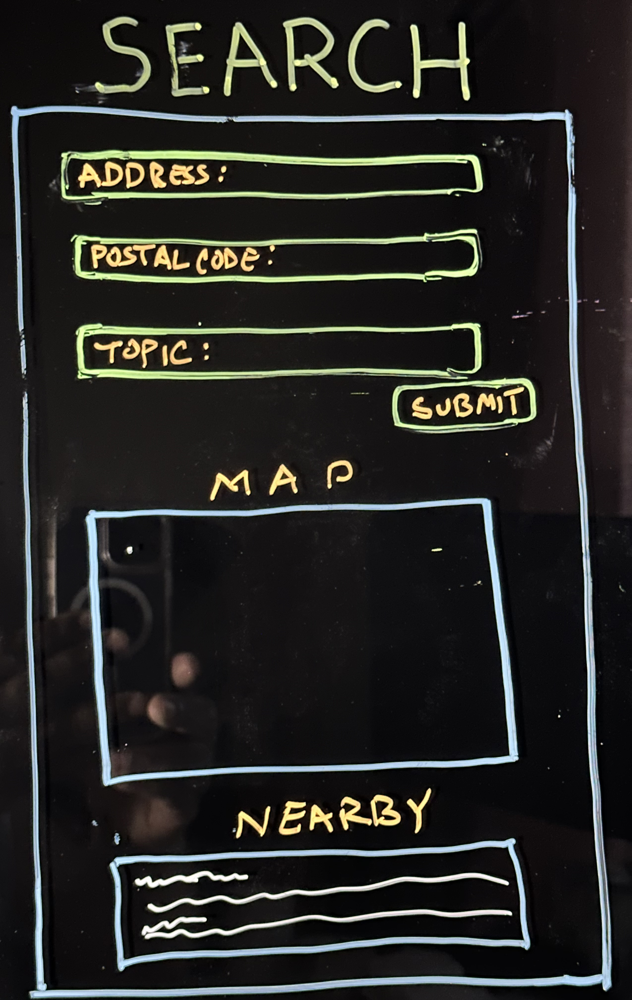

# App Planning Lab

## Getting Started

1. Fork and clone this repository.

1. Answer the questions below by editing this readme. Leave the questions and prompts, and answer in between them. Make sure when you read back your work that you've written things clearly, so that anyone reading it can easily understand what you've written.

1. Where applicable add screenshots, photos, and links.

1. You will also deploy an `index.html` page to GitHub pages.

## Instructions

You will be planning a new application to develop that will be a competitor for another popular application. Your goal is to determine the minimal functionality required so you can launch your app as soon as possible.

Choose from any popular app. It can be an app for anything:

- Music
- TV/Videos
- Shopping
- Social media
- Blog
- Forum (like Stack Overflow or Reddit)
- Chat app
- Recipes
- Business reviews

## Questions

## Project Managing Tool

#### In 1-3 sentences describe your application.

 My app is for Chats. It is targeted towards single fathers, so they can share resources and community in their locations.

#### What is the name of your application?

Dads Chat

#### Create a minimum of 10 user stories. Make sure to use the format:

- `As a <type of user>, I want to <some goal>, so that <some reason>.`

Write the user stories below. Add more `>` for each user story or use `-` to make a list

- As a single father, I want to create a profile, so that I can connect with other single fathers in my area.
- As a single father, I want to search for other single fathers based on location, so that I can find local support.
- As a single father, I want to join chat rooms based on specific topics, so that I can engage in discussions that interest me.
- As a single father, I want to share resources and tips with other single fathers, so that we can learn from each other.
- As a single father, I want to post questions or seek advice from the community, so that I can get help when needed.
- As a single father, I want to receive notifications when someone interacts with my posts; so that I can stay updated.
- As a single father, I want to organize meetups with other single fathers in my area, so that we can socialize and build a local community.
- As a single father, I want to have the option to make my profile private, so that I can control my privacy settings.
- As a single father, I want to report inappropriate content or users, so that the platform maintains a safe and respectful environment.
- As a single father, I want to customize my profile and add a profile picture, so that others can recognize me.

#### Create a new board

Follow the format provided (name of board, the 5 lists etc.) in the reading.

- Add a minimum of 5 cards (front only) based on your user stories to `Backlog`.
- Add appropriate labels.

Provide a link to your board below.

> [Dads Chat Board](https://trello.com/w/dadschat)

#### For one card, fill out more details, include:

- The business case
- Acceptance criteria
- Notes
- Resources

Move that card to the `Doing` list and assign yourself to it.

Provide a link to the specific card below.

> [Doing Card](https://trello.com/c/F79e6b9F/4-as-a-single-father-i-want-to-share-resources-and-tips-with-other-single-fathers-so-that-we-can-learn-from-each-other)

#### Create one bug card.

Think back to a bug you had in a recent lab or project and do your best to model that example.
It can either be a bug you solved or that you didn't get a chance to solve.

It should include:

- A brief description of the bug.
- The expected behavior.
- The steps to reproduce.
- At least one resource.

Make sure to label it as a bug. Move the card to the `To Do` list.

Provide a link to the specific card below.

> [Bug Card](https://trello.com/c/6adpsByo/6-bug-login-button-not-functioning)

#### Create one chore card

Think back to a chore you had in a recent lab or project and model that example. Move the chore to the `Done` column.

- Assign yourself to it.
- Add a due date.

Provide a link to the specific card below.

> [Chore Card](https://trello.com/c/kAbxA2YN/7-as-a-single-father-i-want-to-have-the-option-to-make-my-profile-private-so-that-i-can-control-my-privacy-settings)

### Wireframes

Create three wireframes. You may use a free online tool or draw them on paper (you can either scan them or use your phone to photograph them). You will upload them to this repository.

1. Create a wireframe for the main page that shows an index view (on mobile).

> ![Mobile Main]

1. Create a wireframe for a wide desktop view for either the index view.

> ![Web Main]

1. Create a wireframe for the view that has a new form (new user, new shipping information, new post, new song, new product etc.) view (on mobile).

> ![Mobile Location Search]

## Minimum Viable Product

Create an `index.html` file and a `styles.css` file. Using your user stories and wireframes build the responsive `index` view. You should use `lorem ipsum` placeholder text and placeholder images, where applicable. The index view should have between 2 and 5 example resources.

Deploy this to GitHub pages.

## Reflection

Write down three things that went well for you doing this lab.
 
 - I was able to come up with user stories that cover different aspects of the application.
 - Creating the wireframes helped visualize the layout and structure of the app.
 - Deploying the index view to GitHub pages was a smooth process.

Write down one thing you'd improve on for next time.

One thing I would improve is providing more detailed acceptance criteria for the user stories and refining the bug and chore card examples to make them more realistic.
